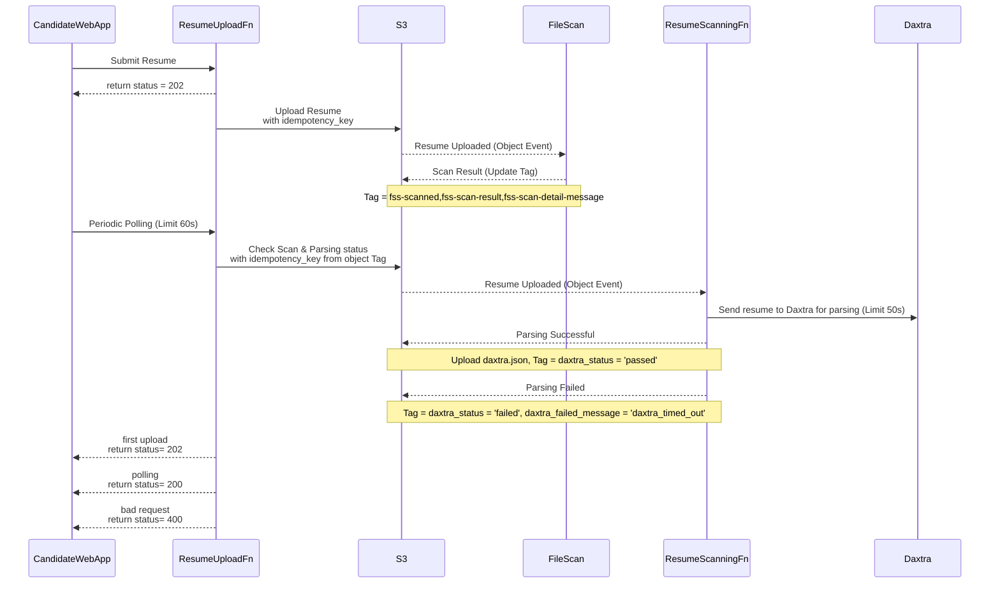

```mermaid
sequenceDiagram

CandidateWebApp->>ResumeUploadFn: Submit Resume
ResumeUploadFn-->>CandidateWebApp: return status = 202

ResumeUploadFn->>S3: Upload Resume <br> with idempotency_key
S3-->>FileScan: Resume Uploaded (Object Event)
FileScan-->>S3: Scan Result (Update Tag)
Note over FileScan,S3: Tag = fss-scanned,fss-scan-result,fss-scan-detail-message

CandidateWebApp->>ResumeUploadFn: Periodic Polling (Limit 60s)
ResumeUploadFn->>S3: Check Scan & Parsing status <br> with idempotency_key from object Tag

S3-->>ResumeScanningFn: Resume Uploaded (Object Event)
ResumeScanningFn->>Daxtra: Send resume to Daxtra for parsing (Limit 50s)

ResumeScanningFn-->>S3: Parsing Successful
Note over ResumeScanningFn,S3: Upload daxtra.json, Tag = daxtra_status = 'passed'
ResumeScanningFn-->>S3: Parsing Failed
Note over ResumeScanningFn,S3: Tag = daxtra_status = 'failed', daxtra_failed_message = 'daxtra_timed_out'

ResumeUploadFn-->>CandidateWebApp: first upload <br> return status= 202
ResumeUploadFn-->>CandidateWebApp: polling <br> return status= 200
ResumeUploadFn-->>CandidateWebApp: bad request <br> return status= 400
```
